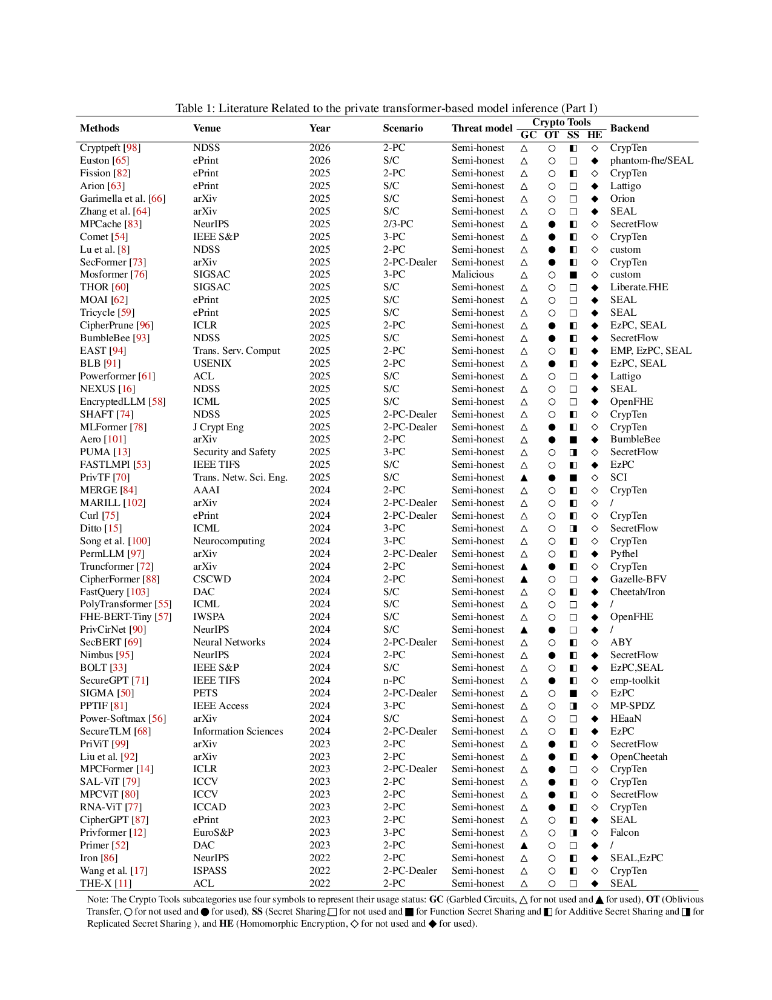

# Sok: Private Transformer-based Model Inference

## Table of Contents
- [Introduction](#introduction)
- [MPC-based PPLLM](#mpc-based-ppllm)
- [HE-based PPLLM](#he-based-ppllm)
- [Hybrid Encryption PPLLM](#hybrid-encryption-ppllm)
- [Quantization Optimization PPLLM](#quantization-optimization-ppllm)
- [Comiler Optimization PPLLM](#comiler-optimization-ppllm)
- [Commonly Used Cryptographic Backbones For private Transforme-based Model Inference](#commonly-used-cryptographic-backbones-for-private-transforme-based-model-inference)

## Introduction

This work goes beyond a simple summary of existing studies. It provides a systematic and in-depth analysis of prior approaches, identifies their limitations and gaps, and offers new insights. As summarized in [Table 1](imgs/table_1.svg), we examine existing surveys on privacy-preserving inference. However, rather than merely cataloging prior work, we emphasize systematic comparison and analysis to uncover the intrinsic differences and limitations.

## MPC-based PPLLM

* [NDSS 2026] [Cryptpeft: Efficient and private neural network inference via parameter efficient fine-tuning](https://arxiv.org/pdf/2508.12264) ([code available](https://github.com/Saisai-Xia/CryptPEFT))

* [ePrint 2025] [Fission: Distributed Privacy-Preserving Large Language Model Inference](https://eprint.iacr.org/2025/653.pdf) ([code available](https://github.com/jimouris/curl))

* [IEEE S&P 2025] [Comet: Accelerating private inference for large language model by predicting activation sparsity](https://arxiv.org/pdf/2505.07239)

* [arXiv 2025] [SecFormer: Fast and Accurate Privacy-Preserving Inference for Transformer Models via SMPC](https://arxiv.org/abs/2401.00793) ([code available](https://github.com/jinglong696/SecFormer))

* [J Crypt Eng 2025] [Mlformer: a high performance mpc linear inference framework for transformers.](https://cetinkayakoc.net/docs/j95.pdf)

* [Security and Safety 2025] [PUMA: Secure inference of LLaMA-7B in five minutes](https://sands.edpsciences.org/articles/sands/pdf/2025/01/sands20250020.pdf) ([code available](https://github.com/secretflow/spu/tree/main/examples/python/ml/flax_llama7b))

* [Trans. Netw. Sci. Eng.] [PrivTF: Efficient and Privacy-Preserving Transformer Inference With Optimized Protocols for Secure NLP](https://doi.org/10.1109/TNSE.2025.3605623)

* [AAAI 2024] [MERGE: Fast private text generation](https://ojs.aaai.org/index.php/AAAI/article/download/29964/31687)

* [ePrint 2024] [Curl: Private LLMs through Wavelet-Encoded Look-Up Tables](https://eprint.iacr.org/2024/1127.pdf) ([code available](https://github.com/jimouris/curl))

* [Neurocomputing 2024] [Private preserving language model inference based on secure multi-party computation](https://doi.org/10.1016/j.neucom.2024.127794)

* [arXiv 2024] [TruncFormer: Private LLM Inference Using Only Truncations](https://arxiv.org/pdf/2412.01042)

* [Neural Networks 2024] [SecBERT: Privacy-preserving pre-training based neural network inference system](https://doi.org/10.1016/j.neunet.2024.106135)

* [IEEE TIFS 2024] [SecureGPT: A Framework for Multi-Party Privacy-Preserving Transformer Inference in GPT](https://doi.org/10.1109/TIFS.2024.3461408) 

* [PETS 2024] [Sigma: Secure GPT Inference with Function Secret Sharing](https://eprint.iacr.org/2023/1269.pdf) ([code available](https://github.com/mpc-msri/EzPC/tree/master/GPU-MPC/experiments/sigma))

* [IEEE Access 2024] [PPTIF: Privacy-preserving transformer inference framework for language translation](https://ieeexplore.ieee.org/stamp/stamp.jsp?arnumber=10488366)

* [arXiv 2023] [PriViT: Vision Transformers for Fast Private Inference](https://arxiv.org/pdf/2310.04604) ([code available](https://github.com/NYU-DICE-Lab/privit))

* [ICCV 2023] [SAL-ViT: Towards Latency Efficient Private Inference on ViT using Selective Attention Search with a Learnable Softmax Approximation](https://openaccess.thecvf.com/content/ICCV2023/papers/Zhang_SAL-ViT_Towards_Latency_Efficient_Private_Inference_on_ViT_using_Selective_ICCV_2023_paper.pdf) 

* [ICCV 2023] [MPCViT: Searching for Accurate and Efficient MPC-Friendly Vision Transformer with Heterogeneous Attention](https://openaccess.thecvf.com/content/ICCV2023/papers/Zeng_MPCViT_Searching_for_Accurate_and_Efficient_MPC-Friendly_Vision_Transformer_with_ICCV_2023_paper.pdf) ([code available](https://github.com/PKU-SEC-Lab/mpcvit))

* [ICCAD 2023] [RNA-ViT: Reduced-Dimension Approximate Normalized Attention Vision Transformers for Latency Efficient Private Inference](https://howardli0816.github.io/files/RNA_ViT.pdf)

* [EuroS&P 2023] [Privformer: Privacy-preserving Transformer with MPC](https://ieeexplore.ieee.org/stamp/stamp.jsp?tp=&arnumber=10190506) 

* [ISPASS 2022] [Characterization of MPC-based Private Inference for Transformer-based Models](https://par.nsf.gov/servlets/purl/10462364)

## HE-based PPLLM

* [ePrint 2026] [Euston: Efficient and user-friendly secure transformer inference with non-interactivity](https://eprint.iacr.org/2026/046.pdf) ([code available](https://github.com/FLL-Lab/Euston))

* [ePrint 2025] [Arion: Attention-Optimized Transformer Inference on Encrypted Data](https://eprint.iacr.org/2025/2271.pdf) ([code available](https://github.com/hangenba/Arion))

* [arXiv 2025] [Practical Secure Inference Algorithm for a Fine-Tuned Large Language Model Based on Fully Homomorphic Encryption](https://doi.org/10.1109/TIFS.2025.3639994)

* [SIGSAS 2025] [THOR: Secure Transformer Inference with Homomorphic Encryption](https://dl.acm.org/doi/pdf/10.1145/3719027.3765150)([code available](https://github.com/crypto-starlab/THOR))

* [ePrint 2025] [Moai: Module-optimizing architecture for non-interactive secure transformer inference](https://eprint.iacr.org/2025/991.pdf) ([code available](https://github.com/dtc2025ag/MOAI)) ([GPU implementation](https://github.com/dtc2025ag/MOAI_GPU))

* [ePrint 2025] [Tricycle: Private Transformer Inference with Tricyclic Encodings](https://eprint.iacr.org/2025/1200.pdf)

* [ACL 2025] [Powerformer: Efficient and High-Accuracy Privacy-Preserving Language Model with Homomorphic Encryption](https://aclanthology.org/2025.acl-long.543.pdf) ([code available](https://github.com/thrudgelmir/Powerformer))

* [NDSS 2025] [Secure Transformer Inference Made Non-interactive](https://www.ndss-symposium.org/wp-content/uploads/2025-868-paper.pdf) ([code available](https://github.com/zju-abclab/NEXUS))

* [ICML 2025] [EncryptedLLM: Privacy-Preserving Large Language Model Inference via GPU-Accelerated Fully Homomorphic Encryption](https://openreview.net/pdf?id=PGNff6H1TV)

* [NDSS 2025] [SHAFT: Secure, Handy, Accurate, and Fast Transformer Inference](https://www.ndss-symposium.org/wp-content/uploads/2025-2287-paper.pdf) ([code available](https://github.com/andeskyl/SHAFT))

* [arXiv 2025] [ENSI: Efficient Non-Interactive Secure Inference for Large Language Models](https://arxiv.org/pdf/2509.09424) ([code available](https://github.com/sugarhh/ENSI))

* [arXiv 2025] [Encryption-Friendly LLM Architecture](https://arxiv.org/pdf/2410.02486) ([code available](https://github.com/Donghwan-Rho/Encryption-friendly_LLM_Architecture))

* [ICML 2024] [Converting Transformers to Polynomial Form for Secure Inference Over Homomorphic Encryption](https://openreview.net/pdf?id=9HPoJ6ulgV) ([code available](https://github.com/IBM/PolyTransformer))

* [IWSPA 2024] [Transformer-based language models and homomorphic encryption: An intersection with bert-tiny](https://dl.acm.org/doi/pdf/10.1145/3643651.3659893) ([code available](https://github.com/lorenzorovida/FHE-BERT-Tiny))

* [arXiv 2024] [Power-Softmax: Towards Secure LLM Inference over Encrypted Data](https://arxiv.org/pdf/2410.09457)

* [ACL 2022] [THE-X: Privacy-Preserving Transformer Inference with Homomorphic Encryption](https://arxiv.org/pdf/2206.00216)

## Hybrid Encryption PPLLM

* [ICLR 2025] [CipherPrune: Efficient and scalable private transformer inference](https://arxiv.org/pdf/2502.16782) ([code available](https://github.com/UCF-Lou-Lab-PET/cipher-prune-inference))

* [NDSS 2025] [BumbleBee: Secure Two-party Inference Framework for Large Transformers](https://www.ndss-symposium.org/wp-content/uploads/2025-57-paper.pdf) ([code available](https://github.com/AntCPLab/OpenBumbleBee))

* [Trans. Serv. Comput 2025] [East: Efficient and Accurate Secure Transformer Framework for Inference](https://arxiv.org/pdf/2308.09923)

* [USENIX 2025] [Breaking the layer barrier: Remodeling private transformer inference with hybrid {CKKS}and{MPC}](https://www.usenix.org/system/files/usenixsecurity25-xu-tianshi.pdf) ([code available](https://zenodo.org/records/15590214))

* [IEEE TIFS 2025] [Accelerating Private Large Transformers Inference Through Fine-Grained Collaborative Computation](https://doi.org/10.1109/TIFS.2025.3584639)

* [arXiv 2024] [PermLLM: Private Inference of Large Language Models within 3 Seconds under WAN](https://arxiv.org/pdf/2405.18744)

* [NeurIPS 2024] [PrivCirNet: Efficient Private Inference via Block Circulant Transformation](https://proceedings.neurips.cc/paper_files/paper/2024/file/ca9873918aa72e9033041f76e77b5c15-Paper-Conference.pdf) ([code available](https://github.com/Tianshi-Xu/PrivCirNet))

* [NeurIPS 2024] [Nimbus: Secure and Efficient Two-Party Inference for Transformers](https://proceedings.neurips.cc/paper_files/paper/2024/file/264a9b3ce46abdf572dcfe0401141989-Paper-Conference.pdf) ([code available](https://github.com/secretflow/spu/tree/nimbus))

* [IEEE S&P 2024] [BOLT: Privacy-Preserving, Accurate and Efficient Inference for Transformers](https://eprint.iacr.org/2023/1893.pdf) ([code available](https://github.com/Clive2312/EzPC/tree/bert))

* [Information Sciences 2024] [SecureTLM: Private inference for transformer-based large model with MPC](https://doi.org/10.1016/j.ins.2024.120429)

* [arXiv 2023] [LLMs Can Understand Encrypted Prompt: Towards Privacy-Computing Friendly Transformers](https://arxiv.org/pdf/2305.18396)

* [ePrint 2023] [CipherGPT: Secure Two-Party GPT Inference](https://eprint.iacr.org/2023/1147.pdf) 

* [DAC 2023] [Primer: Fast Private Transformer Inference on Encrypted Data](https://arxiv.org/pdf/2303.13679)

* [NeurIPS 2022] [Iron: Private Inference on Transformers](https://proceedings.neurips.cc/paper_files/paper/2022/file/64e2449d74f84e5b1a5c96ba7b3d308e-Paper-Conference.pdf)

## Quantization Optimization PPLLM

* [NeurIPS 2025] [MPCache: MPC-friendly KV cache eviction for efficient private LLM inference](https://openreview.net/pdf?id=kd6hcHUl9C) ([code available](https://github.com/zwxandy/MPCache))

* [NDSS 2025] [A New PPML Paradigm for Quantized Models](https://www.ndss-symposium.org/wp-content/uploads/2025-2872-paper.pdf)

* [SIGSAS 2025] [Mosformer: Maliciously Secure Three-Party Inference Framework for Large Transformers](https://dl.acm.org/doi/pdf/10.1145/3719027.3765028)([code available](https://github.com/XidianNSS/Mosformer))

* [arXiv 2025] [Entropy-Guided Attention for Private LLMs](https://arxiv.org/pdf/2501.03489) ([code available](https://github.com/Nandan91/entropy-guided-attention-llmr))

* [ICML 2024] [Ditto: Quantization-aware secure inference of trans formers upon MPC](https://arxiv.org/pdf/2405.05525) ([code available](https://github.com/secretflow/spu/tree/ditto_icml24))

* [CSCWD 2024] [CipherFormer: Efficient Transformer Private Inference with Low Round Complexity](https://arxiv.org/pdf/2403.16860)

* [DAC 2024] [FastQuery: Communication-efficient Embedding Table Query for Private LLMs inference](https://dl.acm.org/doi/pdf/10.1145/3649329.3657374)

* [arXiv 2024] [MPC-Minimized Secure LLM Inference](https://arxiv.org/pdf/2408.03561)

* [ICLR 2023] [MPCFormer: fast, performant and private Transformer inference with MPC](https://arxiv.org/pdf/2211.01452) ([code available](https://github.com/MccRee177/MPCFormer))

## Compiler Optimization PPLLM

* [arXiv 2025] [Network and Compiler Optimizations for Efficient Linear Algebra Kernels in Private Transformer Inference](https://arxiv.org/pdf/2512.11135)

## Commonly Used Cryptographic Backbones For private Transforme-based Model Inference

| **Library**          | **Year** | **Support**                | **Language**   | **w. GPU** | **Repository Link**                        |
|-----------------------|----------|----------------------------|----------------|------------|--------------------------------------------|
| HElib                 | 2020     | BGV, CKKS                  | C++            | ✅         | [https://github.com/homenc/HElib](https://github.com/homenc/HElib) |
| Pyfhel               | 2021     | BGV, BFV, CKKS             | Python & C++   | ❌         | [https://github.com/ibarrond/Pyfhel](https://github.com/ibarrond/Pyfhel) |
| SEAL                  | 2018     | BGV, BFV, CKKS             | C++            | ✅*        | [https://github.com/microsoft/SEAL](https://github.com/microsoft/SEAL) |
| OpenFHE               | 2022     | BGV, BFV, CKKS             | C++, Python    | ❌         | [https://github.com/openfheorg/openfhe-development](https://github.com/openfheorg) |
| TFHE-rs               | 2022     | TFHE                       | C, Rust        | ❌         | [https://github.com/zama-ai/tfhe-rs](https://github.com/zama-ai/tfhe-rs) |
| Lattigo               | 2024     | BGV, BFV, CKKS             | Go             | ❌         | [https://github.com/tuneinsight/lattigo](https://github.com/tuneinsight/lattigo) |
| HeOnGPU               | 2024     | BGV, BFV, CKKS, TFHE       | C++            | ✅         | [https://github.com/Alisah-Ozcan/HEonGPU](https://github.com/Alisah-Ozcan/HEonGPU) |
| ABY               | 2015     | MPC                        | C++            | ❌         | [https://github.com/encryptogroup/ABY](https://github.com/encryptogroup/ABY) |
| EMP-toolkit           | 2016     | MPC                        | C++            | ❌         | [https://github.com/emp-toolkit](https://github.com/emp-toolkit) |
| ABY $^3$               | 2018     | MPC                        | C++            | ❌         | [https://github.com/ladnir/aby3](https://github.com/ladnir/aby3) |
| CrypTen               | 2019     | MPC                        | Python         | ✅         | [https://github.com/facebookresearch/CrypTen](https://github.com/facebookresearch/CrypTen) |
| MP-SPDZ               | 2016     | MPC, HE                    | Python & C++   | ❌         | [https://github.com/data61/MP-SPDZ](https://github.com/data61/MP-SPDZ) |
| EzPC                  | 2019     | MPC, HE                    | C++            | ✅         | [https://github.com/mpc-msri/EzPC](https://github.com/mpc-msri/EzPC) |
| Secretflow            | 2023     | MPC, HE                    | Python & C++   | ✅*        | [https://github.com/secretflow/secretflow](https://github.com/secretflow/secretflow) |

---

**Note:**  
- '**w. GPU**' indicates whether a library supports GPU acceleration: '**✅**' supported, '**❌**' indicates no GPU support.  
- A '**✅***' indicates that open-source GPU support exists, but is not natively supported by the library.